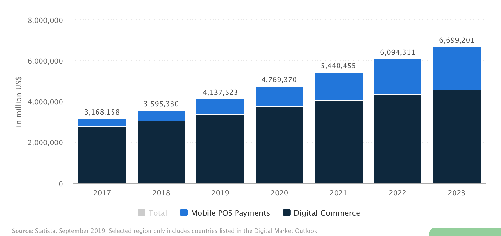

# STRIPE | FinTech Case Study
*By Ian Walter*
## Overview and Origin
 <sub>[3](https://stripe.com)</sub>

Stripe, co-founded in 2010 by brothers John and Patrick Collison, was originally named /Dev/Payments<sub>[1](www.startupgrind.com/blog/the-collison-brothers-and-story-behind-the-founding-of-stripe/)</sub>. They were looking for a way to simplify accepting payments online. While Paypal already existed, solving some of the larger issues such as non-payments, non-US payments, and fraud, they wanted to develop a truly user-friendly way for integration and use.

 <sub>[1](www.startupgrind.com/blog/the-collison-brothers-and-story-behind-the-founding-of-stripe/)</sub>

Funding came in first from Y Combinator from prior connections Patrick had. From there, the company continued to attract investors and they raised $2 MM in 2011 from Paypal's founders<sub>[2](www.techcrunch.com/2011/03/28/stealth-payment-startup-stripe-paypal/)</sub>.

## Business Activities:


Stripe broached the issue of user-friendly online payments, and surpassed that bound and are now focused on the full funnel of online payments for ecommerce sites<sub>[3](https://stripe.com)</sub>. 

Focusing on companies with online retailers across the globe provides a large market opportunity on the upwards of 24 MM eCommerce stores on the internet as of 2017<sub>[4](https://www.quora.com/How-many-ecommerce-sites-are-there-in-the-world-1)</sub>. They focus as an online business in B2B and B2C as a payments provider.

Their key differentiator is the easy adaption for developers to utilize their product. They even offer a peak into the coding on their homepage<sub>[3](https://stripe.com)</sub>.
```
// Require the Stripe library with a test secret key.
const stripe = require('stripe')('sk_test_BQokikJOvBiI2HlWgH4olfQ2');

// Create a payment intent to start a purchase flow.
let paymentIntent = await stripe.paymentIntents.create({
  amount: 2000,
  currency: 'usd',
  description: 'My first payment',
});

// Complete the payment using a test card.
paymentIntent = await stripe.paymentIntents.confirm(paymentIntent.id, {
  payment_method: 'pm_card_mastercard',
});

// Click “▶ run” to try this code live and create your first payment.
```

Their technology is currently open source and touches a wide breadth of tools including: stripe-cli, ios-dashbaord-ui, react-stripe-js, sorbet, einhorn, veneur, skycfg, go-einhorn, pd2pg, smokescreen, subprocess, unilog, bonsai, brushfire, topmodel, herringbone, mongoriver, mosql, safesql, sequins, and timberlake<sub>[5](https://stripe.com/open-source)</sub>.


## Landscape:

As a payments provider, Stripe plays in a highly competitive field that is constantly growing and changing. In the last 10 years, frictionless systems have disrupted the barrier to entry that original payment systems created due to their near-instant, cheap, and secure profiles<sub>[6](https://www.entrepreneur.com/article/346185)</sub>. It has been seen that people want to exchange money for services and products by utilizing transactions that should be seamless and immediate. With these demands from companies and the population, the need for blockchain is rearing its head.

Major competitors started with Paypal's entry to digital payments, and now has grown to include Soramitsu, Algorand beyond the Circle, Remitly, Braintree, Aeropay, and Affirms of the world<sub>[7](https://builtin.com/fintech/fintech-payments-companies-examples)</sub> back in 2017; Statista<sub>[8](https://www.statista.com/outlook/296/100/digital-payments/worldwide#market-marketDriver)</sub>.


## Results

While Stripe started initially building out the payments sector of its business for easy integration, there has been a seismic shift in recent years to include a wider range of finical services including: cash advancements, credit cards, incorporated services, and fraud protection among others<sub>[3](https://stripe.com)</sub><sub>[9](https://techcrunch.com/2019/09/19/stripe-is-raising-another-250m-at-a-35b-pre-money-valuation/)</sub>. Stripe continues to expand not only their product offering, but also their geographical footprint with the latest growth being across Malaysia<sub>[10](https://stripe.com/newsroom/news/malaysia-launch)</sub> and Mexico<sub>[11](https://stripe.com/newsroom/news/stripe-launches-mexico)</sub>.

One of the main measures of success is the increase in volume of non-cash payments. Capgemini and BNP Pariabs anticipated 726 BN digital transactions by 2020<sub>[7](https://builtin.com/fintech/fintech-payments-companies-examples)</sub> back in 2017; Statista<sub>[8](https://www.statista.com/outlook/296/100/digital-payments/worldwide#market-marketDriver)</sub> indicated that digital payments would have a total transaction value of $4,769,370 MM in 2020 (+15.3% yoy). 

<sub>[8](https://www.statista.com/outlook/296/100/digital-payments/worldwide#market-marketDriver)</sub> 

Another key indicator for companies in the payment sector for companies is their valuation. In the beginning of 2019, Stripe was valued at $22.5 BN. By the end of the year, Stripe was valued at $35 BN raising $350 MM during throughout the year in funding<sub>[9](https://techcrunch.com/2019/09/19/stripe-is-raising-another-250m-at-a-35b-pre-money-valuation/)</sub>.


## Recommendations

As Stripe has had nearly a decade of solid growth and a strategy that has not only expanded their portfolio of products, but also their global footprint, a move that would make sense given their reach and experience would be to tap into a new market of B2B. My recommendation, given my background in media and advertising, would be to upend the current legacy systems that have been in place.

The current market for advertising B2B finances and payment is in dire need of a full reboot. The main system used by the key players in the space, such as WWP which is the holding company of the holding company GroupM, is an antique called Donavan. The user interface is clucky at best and as friendly as an untrained rottweiler. While systems has been developed to plug in to Donavan and provide out-channels for purchases to link into other businesses for media purchases (*example: a Media Agency would buy banner ads—the media—from Google, a plug in would sync with the buy statement to send out the banner line items to Google for implementation*), the necessity still exists for much manual intervention to ensure the proper outputs.

If they could disrupt this program, by developing a fluid in-out system that could allow for payment collection, invoice receptions, and automated transfers, this payment system would prevent media agencies from acting as banks, while upending an entire industry. 

This type of integration maintains the original brand moto of disruption with user-friendly integration. It would benefit Stripe by being the first to overtake legacy systems that still have interfaces designed in the 90's, while managing a large share of money movement across the world given the size of the marketing industry and the amount of money that goes into any given ad campaign. 

This would also provide the opportunity to tap into new clients that work with advertising agencies to expand their client base and continue to grow their B2B partnerships.

Beyond their current integrations, in order to integrate into an ad agency and media partner's system, APIs would have to be set up in order to connect payment portals into the various systems. These connections would take a step beyond finance to include the likes of a marketing placement tag. The tags would be the line items of a buy that would then be activated within the interface of the various media programs. 

## Bibliography
1.
```
 Andersen, Derek. “The Collison Brothers and Story Behind The Founding Of Stripe.” Startup Grind, Stratupgrind, 2012, www.startupgrind.com/blog/the-collison-brothers-and-story-behind-the-founding-of-stripe/.
 ```
2.
```
Arrington, Michael. “Stealth Payment Startup Stripe Backed By PayPal Founders.” TechCrunch, TechCrunch, 29 Mar. 2011, techcrunch.com/2011/03/28/stealth-payment-startup-stripe-paypal/.
```
3.
```
“Stripe.” Online Payment Processing for Internet Businesses, stripe.com/.
```
4.
```
“How Many Ecommerce Sites Are There in the World?” Quora, www.quora.com/How-many-ecommerce-sites-are-there-in-the-world-1.
```
5.
```
“Stripe.” Open Source Software, stripe.com/open-source.
```
6.
```
Tariq, Imran. “How Fintech Startups Are Disrupting the Payments Industry.” Entrepreneur, 21 Feb. 2020, www.entrepreneur.com/article/346185.
```
7.
```
Schroer, Alyssa. “These 25 Fintech Payment Solutions Make Moving Money Faster, Simpler and More Secure.” Built In, 16 Mar. 2019, builtin.com/fintech/fintech-payments-companies-examples.
```
8.
```
“Digital Payments - Worldwide: Statista Market Forecast.” Statista, www.statista.com/outlook/296/100/digital-payments/worldwide#market-marketDriver.
```
9.
```
Lunden, Ingrid. “Payments Giant Stripe Is Raising Another $250M at a $35B Pre-Money Valuation.” TechCrunch, TechCrunch, 19 Sept. 2019, techcrunch.com/2019/09/19/stripe-is-raising-another-250m-at-a-35b-pre-money-valuation/.
```
10.
```
“Stripe Newsroom: Stripe Launches in Malaysia.” Newsroom: Stripe Launches in Malaysia, stripe.com/newsroom/news/malaysia-launch.
```
11.
```
“Stripe Newsroom: Stripe Launches in Mexico.” Newsroom: Stripe Launches in Mexico, stripe.com/newsroom/news/stripe-launches-mexico.
```
